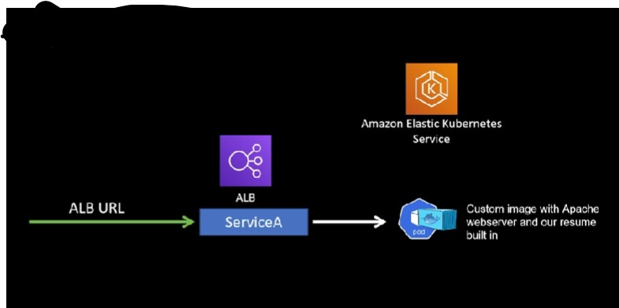

# LearningEKS
### Architecture Diagram


### Steps
1. Download Apache web server image
``` sudo yum install httpd -y```
2. Create a `DockerFile` in the same folder as your html and css file. Write the following code int he DockerFile:
   ```
   FROM httpd
   COPY deatiled-resume.html /usr/local/www/index.html
   COPY style.css /usr/local/www/style.css
   ```
   This Dockerfile will modify the httpd image and will copy your html code to index.html of the httpd server
3. Go to terminal and navigate to the directory containing the DockerFile. Build a custom image by writing the following command.
   ```console
   docker build -t custom-httpd .
   docker images
   ```
   This command will list your docker images. You will notice your newly created image in the list of images. Note the image-id of `custom-httpd` image
5. Create an account on [GitHub](https://hub.docker.com/) Create a public repository with name `custom-httpd`
6. Push the new image to Docker hub by typing the following commands in terminal
   ```console
   docker login --username=(your-username)
   ```
   It will prompt you to enter your password.
   ```console
   docker tag (your-image-id) (user-name)/custom-httpd
   docker push (user-name)/custom-httpd
   ```
   Now your custom image is available on DockerHub.
7. Install `eksctl` and `kubectl`
   ```console
   choco install eksctl
   choco install kubectl
   ```
8. Login in to aws through terminal. Create eks cluster.
   ```console
   eksctl create cluster --node-type t2.micro --nodes 2
   ```
9. In yaml file, change image name to reflect new image. Replace `httpd` with `(your-username)/custom-httpd`
10. Create services and deployment using new image on every Kuberenetes pod. Type this command in terminal.
    ```console
    kubectl apply -f loadbalancerservice.yaml
    ```
11. Go to AWS console and check the formation of EKS cluster.
 
